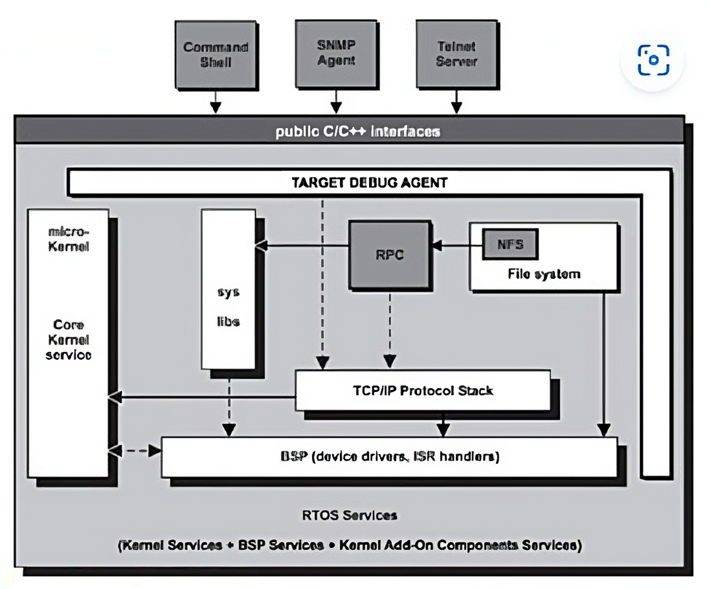
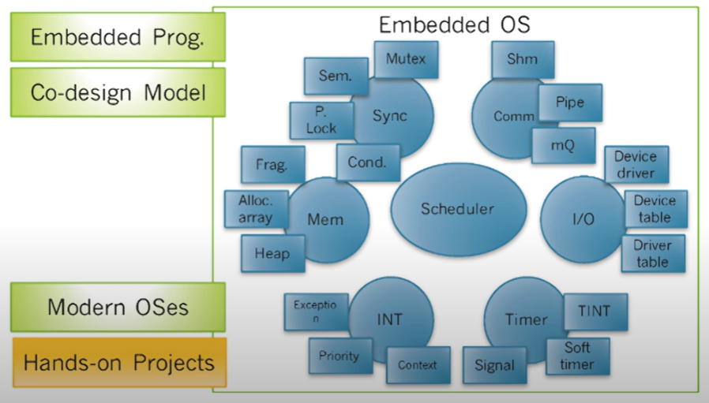
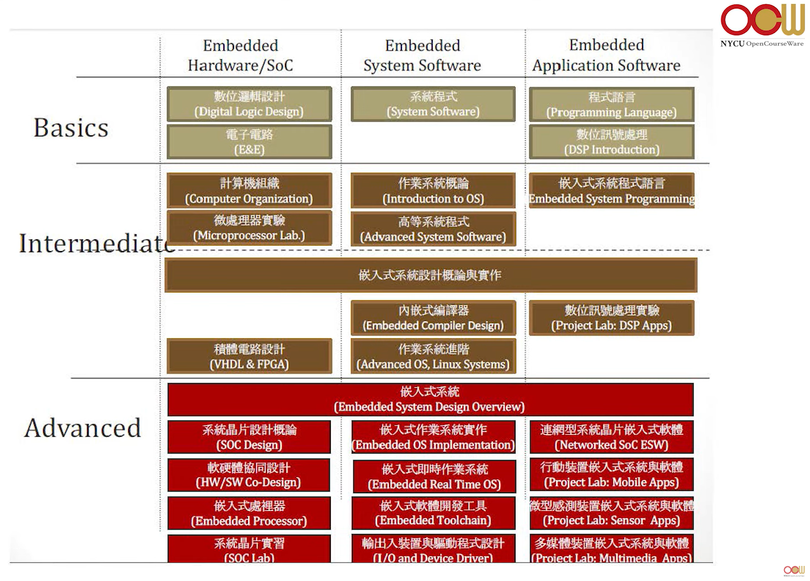
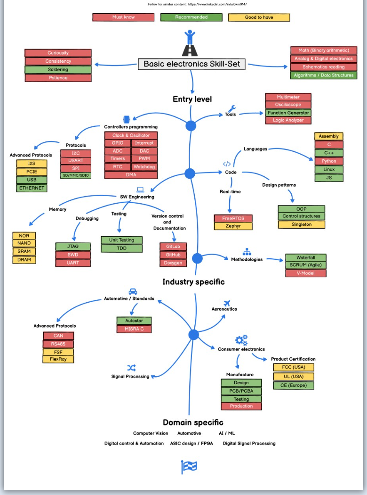

# Interview - C and OS #

```C
/* Hi, this is MAIN page. */
```

## Learning Resource ##

* 計算機結構 - 黃婷婷教授

<div style="text-align:center">
    
    <p>Computer Architecture</p>
</div>

* 作業系統 - 周志遠教授

* 作業系統 - 陳士杰教授

* 嵌入式作業系統 - 黃育綸教授

<div style="text-align:center">
    
    <p>RTOS Architecture</p>
</div>

<div style="text-align:center">
    
    <p>Embedded OS Course Map</p>
</div>

* 微處理機 -  鄭雲謙教授

<div style="text-align:center">
    
    <p>Related course of Microprocessor</p>
</div>

* 作業系統 Operating System Concepts 10/e - Abraham Silberschatz , Peter Raer Galvin , Greg Gagne 著 吳庭育、駱詩軒 譯

* C 語言教學手冊第四版 - 洪維恩

* Embedded Engineer RoadMap 2022 - Alok Mishra
  * <https://www.linkedin.com/posts/nazirahmed-tolagi-388b2822_embedded-engineer-roadmap-2022-activity-6963680658061737984-_MzE/>

<div style="text-align:center">
    
    <p>Embedded Engineer RoadMap 2022</p>
</div>

* System Software Introduction - 脆脆, 2022 iThome 鐵人賽
  * <https://ithelp.ithome.com.tw/users/20152298/ironman/5622>

* 你所不知道的C語言：指標篇 - 宅色夫
  * <https://hackmd.io/@sysprog/c-pointer?type=view>

## Interview Resource ##

* C語言測試 應知道的0x10個基本問題
  * <https://creteken.pixnet.net/blog/post/24524138>

* 面試整理 - 陳家錡
  * <https://hackmd.io/@g9tdU4gDSTiEZrerd0g7-w/SyCXEfsSE>

* 面試 C/C++ 觀念整理 - Skyler Chen
  * <https://skylerz.medium.com/%E9%9D%A2%E8%A9%A6-c-c-%E8%A7%80%E5%BF%B5%E6%95%B4%E7%90%86-3a259b0a09bc>

* 2017Homework1-整理面試題目 - 陳致佑
  * <https://hackmd.io/@6zSPCmL1Szq0bq_rOqcO6w/HkkhJ-ah-?type=view>

* C/C++ - 常見 C 語言觀念題目總整理（適合考試和面試）- Mr. Opengate
  * <https://www.mropengate.com/2017/08/cc-c.html>

* C/C++ 常見試題 - Yu-Pu Wu
  * <https://medium.com/@earth875/c-c-%E5%B8%B8%E8%A6%8B%E8%A9%A6%E9%A1%8C-961619b14f88>

* 面試心得 - dcard 不刪文的小可愛
  * <https://www.dcard.tw/f/tech_job/p/239480651?cid=C3FCFA9E-387E-466F-AF6B-1D7063437C4E>

## 縮寫 abbreviation ##

* JD : job description

* 開發板支援套裝軟體 (board support package, BSP)

* 基板管理控制器 (Board Management Controller, BMC)

* 系统管理控制器 (System Management Control, SMC)

## Inspirational Quotes ##

* "A language that doesn't affect the way you think about programming is not worth knowing." - Alan Perlis
  * 一個語言如果不改變你的思考方式，就不值得學。

* 學習不要從"基礎的"開始，而是要從"有用的"開始。

* "Doing the right thing is more important than doing things right." - Peter Drucker
  * 做對的事情，比把事情做對更重要。

* "Don't reinvent the wheel." - McKinsey
  * 不要重新發明輪子。

* 設計自己身處的環境，有意識的不停跳到更好更上面的層次，不要停在某個區域太久。

* 工程師的三種能力
  * 駕馭複雜工具的能力 : 解決問題才是工程師的重要意義，瞭解並發明工具只是其次，清楚學習最初的目的，不迷失在技術的學習當中。
  * 閱讀的能力 : 許多方法根本沒有機會被寫成教學文章，或是在社群中被提問出來，學會看別人的code，不重新造輪子。
  * 選擇的能力 : 知道自己要什麼，問自己究竟需要什麼。

* "Don’t Let Best be Enemy of Better." - 吳軍
  * 最好，是更好的敵人。
