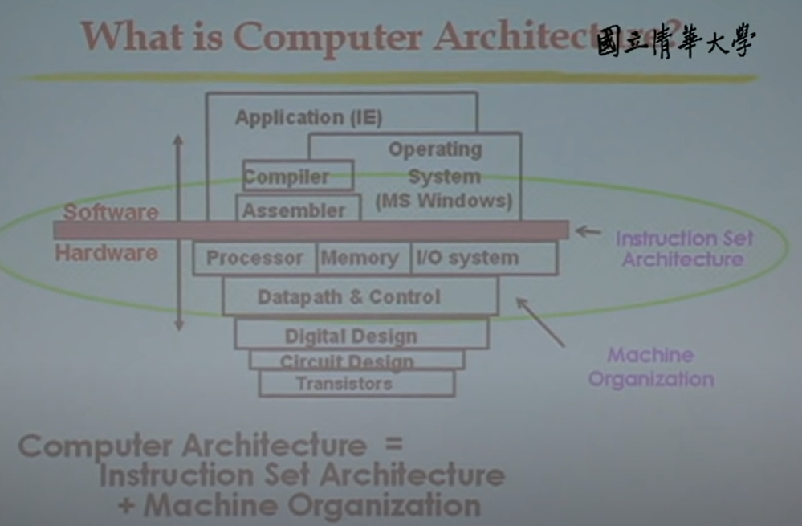

# Computer Architecture #

* Computer Architecture = ISA + Machine Organization
  * 計算機系統結構、電腦系統架構 (Computer Architecture)
  * 指令集架構 (Instruction Set Architecture, ISA)
  * 電腦組織 (Machine Organization)

    
    
Computer Architecture

## Performance ##

* Response time : 一個任務 (task) 需要做多久。

* Throughput : 一個單位時間內，可以做多少個任務 (task) 。

## CPU ##

* Elapsed time : 完整的 Response time。
  * 包含 processing, I/O, OS overhead, idle time

* CPU time :

* CPU clock :
  * clock period
  * clock frequency

* Clock per instruction (CPI)

## Processor ##

* Uniprocessor (unicore microprocessors)

* Multiprocessor (multicore microprocessors)
  * multi programming
  * parallel programming
  * load balance
  * communication
  * synchronize

## Power ##

* Power Consumption
  * dynamic
  * static

## Register Architecture ##

* 累加器 (Accumulator)
  * 1 個 register
  * 不用指定要加到哪一個 register 中，因為只有一個 register。

* Stack
  * 後進先出 (LIFO)
  * 取資料時，操作 top of stack 即可

* 通用暫存器 (General Purpose Register, GPR)
  * Effective Address (EA) : 資料 可能 main memory 或 register

* Load / Store
  * a special case of GPR
  * Load / Store 的 instruction 較 GPR 的 instruction 來得短
  * 將資料從 main memory load 至 register 做處理；將資料從 register store 至 main memory 做儲存。

## Benchmark ##

## Pitfall ##

* 阿姆達爾法則 (Amdahl's law)
  * 在計算機系統結構中，持續最佳化某個元件對整體的最佳化是有上限的；從另一個角度來看，就是在進行整體的最佳化時，應該挑選影響較重大者，已得到較好的效果。

## MIPS ##

* MIPS Registers
  * 32 registers, each is 32 bits wide
    * design principle 2: smaller is faster
