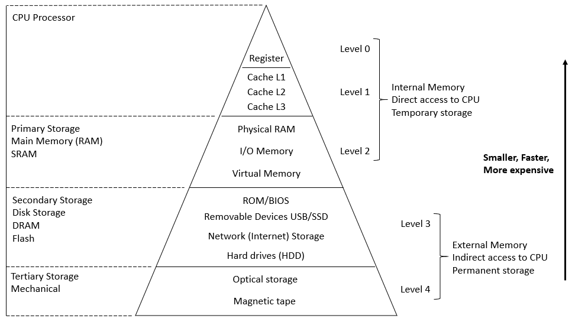

# Computer Architecture #

```C
/* Hi, this is Computer Architecture page. */
```

* Computer Architecture = ISA + Machine Organization
  * 計算機系統結構、電腦系統架構 (Computer Architecture)
  * 指令集架構 (Instruction Set Architecture, ISA)
  * 電腦組織 (Machine Organization)

<div style="text-align:center">
    
    <p>Computer Architecture</p>
</div>

## 指令集架構 (Instruction Set Architecture, ISA) ##

* 又稱指令集或指令集體系
* 指令集與微架構 (又稱計算機組織，microarchitecture) 不同
* 常見種類
  * 複雜指令集運算 (Complex Instruction Set Computing, CISC)
    1. x86 架構，微處理器 (ex. Intel Pentium/Celeron/Xeon, AMD Athlon/Duron/Sempron)
    2. x86-64 架構，Intel 64 (ex. Intel Core/Celeron/Pentium/Xeon, AMD64 Phenom/Athlon/Opteron/AMD APU/Ryzen/EPYC)
  * 精簡指令集運算 (Reduced Instruction Set Computing, RISC)
    1. MIPS
    2. ARM
    3. RISC-V
  * 顯式並行指令運算 (Explicitly Parallel Instruction Computing, EPIC)
    1. IA-64 架構 (ex. Intel Itanium)
  * 超長指令字指令集運算 (VLIW)

### MIPS ###

* MIPS Registers
  * 32 個暫存器，每個都是 32 bits 的寬度，指令也是 32 bits
    * design principle 2: smaller is faster

* 3 種指令的類型
  1. R-type
  2. I-type
  3. J-type

## Performance ##

* Response time : 一個任務 (task) 需要做多久。

* Throughput : 一個單位時間內，可以做多少個任務 (task) 。

## CPU ##

* Elapsed time : 完整的 Response time。
  * 包含 processing, I/O, OS overhead, idle time

* CPU time :

* CPU clock :
  * clock period
  * clock frequency

* Clock per instruction (CPI)

## Processor ##

* Uniprocessor (unicore microprocessors)

* Multiprocessor (multicore microprocessors)
  * multi programming
  * parallel programming
  * load balance
  * communication
  * synchronize

## Power ##

* Power Consumption
  * dynamic
  * static

## Computer Memory ##

<div style="text-align:center">
    
    <p>Computer Memory</p>
</div>

### Register Architecture ###

* 累加器 (Accumulator)
  * 1 個 register
  * 不用指定要加到哪一個 register 中，因為只有一個 register。

* Stack
  * 後進先出 (LIFO)
  * 取資料時，操作 top of stack 即可

* 通用暫存器 (General Purpose Register, GPR)
  * Effective Address (EA) : 資料 可能 main memory 或 register

* Load / Store
  * a special case of GPR
  * Load / Store 的 instruction 較 GPR 的 instruction 來得短
  * 將資料從 main memory load 至 register 做處理；將資料從 register store 至 main memory 做儲存。

## Benchmark ##

## Pitfall ##

* 阿姆達爾法則 (Amdahl's law)
  * 在計算機系統結構中，持續最佳化某個元件對整體的最佳化是有上限的；從另一個角度來看，就是在進行整體的最佳化時，應該挑選影響較重大者，已得到較好的效果。
