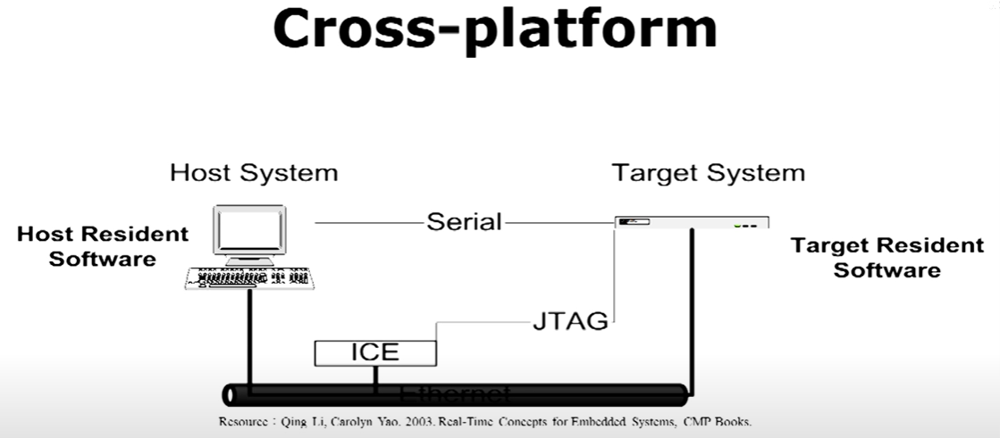
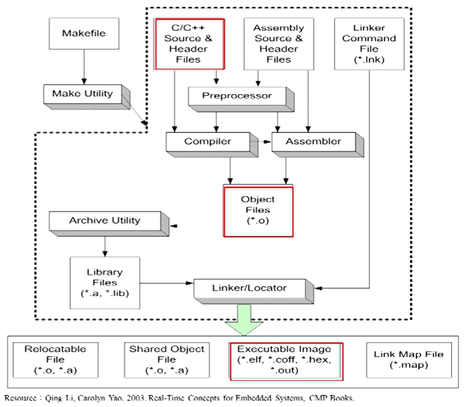

# Embedded OS #

```C
/* Hi, this is Embedded OS page. */
```

## 跨平台 (Cross-platform) ##

* Steps
  1. Compiled programs into object code
  2. linked together into an excutable image

* Host System
  * processor architecture : Intel (IA-32/64 bits)
  * offers
    * cross compiler
    * linker
    * source-level debugger

* Target Embedded System
  * processor architecture : ARM / MIPS
  * offers
    * linker loader
    * monitor
    * debug agent

* connections between host and target system
  * serial interface
  * ICE : JTAG (transmit debug info between host debugger and target debug agent)

* Programs including
  * system software
  * RTOS
  * kernal
  * application code

<div style="text-align:center">
    
    <p>Cross platform</p>
</div>

## create file ##

<div style="text-align:center">
    
    <p>Create file</p>
</div>

## Memory ##

* RAM
* FLASH
* MRAM
* ROM

## RTOS Architecture ##

<div style="text-align:center">
    
    <p>RTOS Architecture</p>
</div>

## Task ##

* Task creation
  * Kernal creates system tasks
  * Kernal starts
    * Init or startup task
    * Idle task
      1. 最低的優先序
      2. 不做事的無窮迴圈
    * Exception-handling task
    * Debug agent task
  * Kernal allocates priority from reserved priority levels
  * Kernal jumps tp a predefined entry point : application

* Task state
  * ready
  * blocked
  * running
  * suspended, pended/delayed
