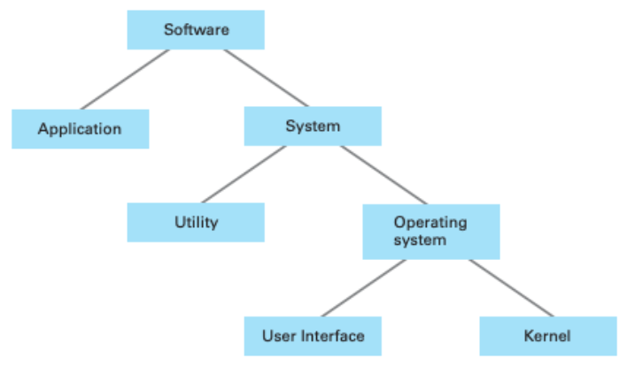
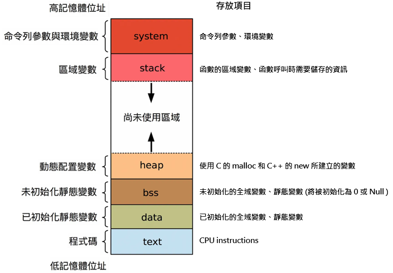

# OS #

```C
/* Hi, this is OS page. */
```

<div style="text-align:center">
    
    <p>Software Architecture</p>
</div>

* Linux 開機流程
  * 步驟
    * BIOS -> MBR -> GRUB -> Kernel -> Init -> Runlevel Scripts
  * 名詞
    * 基本輸入輸出系統 (Basic Input/Output System, BIOS)
    * 主開機紀錄、主引導磁區 (Master Boot Record, MBR)
    * 啟動載入程式 (GNU GRUB, GRUB)
    * 核心、內核 (Kernel)

## Table of contents ##

## 作業系統 (Operating System, OS) ##

* 說明
  * 一組主管並控制電腦操作、運用和執行軟硬體資源和提供服務給使用者的系統軟體程式。
  * 確保 process 可以正確執行，不會讓 process 跟 process 之間互相干擾。
  * 透過 kernel mode 跟 user mode 來保護硬體。
  * 提供 high level 的 system call 讓使用者不能直接操作硬體，簡化操作，也更加有效率等。

## CPU 排班 (CPU Scheduling) ##

* 當討論一般的排班概念時，使用的是行程排班 (process scheduling) ；而提到特定執行緒觀念時，使用的是執行緒排班 (thread scheduling) 。

## 基本輸入輸出系統 (Basic Input/Output System, BIOS) ##

* 說明
  * 是一段由 CPU 執行的 code，讓 CPU 可以知道怎麼初始化硬體、找到可以開機的儲存位置、把 bootloader 載入 RAM，接著跳到 bootloader 的入口點開始執行。

## 啟動載入程式 (Bootstrap Loader, bootloader) ##

* 說明
  * 讓 CPU 知道怎麼將 OS kernel 載入 RAM，並且執行 OS kernel 的初始化。

* 在 Linux 中，是使用 GNU GRUB，是一個來自 GNU 專案的啟動載入程式。GNU GRUB 的前身為使用於類 Unix 系統中的 Grand Unified Bootloader。

## 中斷 (Interrupts) ##

* 說明
  * 指 CPU 接收到來自硬體或軟體的訊號須優先處理，因此暫停當前執行的程式，轉而執行突發的事件，執行結束後，再繼續執行原本尚未完成的程式。

* 種類
  * External Interrupt (外部中斷)
    * CPU 外的週邊元件所引起的。 (I/O Complete Interrupt, I/O Device error)
  * Internal Interrupt (內部中斷)
    * 不合法的用法所引起的。 (Debug、Divide-by-zero、overflow)
  * Software Interrupt (軟體中斷)
    * 使用者程式在執行時，若需要OS 提供服務時，會藉由 System Call 來呼叫 OS 執行對應的 service routine，完成服務請求後，再將結果傳回給使用者程式。

* ISR (Interrupt Service Routine)
  * ISR 簡單來說就是中斷會跳去執行的函式,而他跟 task 或 process 不同的地方是，做 context switch 的時候 ISR 只會 PUSH 部份暫存器,而 task 或 process 會 push 所有的暫存器

* 處理流程
  1. 暫停目前 process 之執行
  2. 保存此 process 當時執行狀況
  3. OS 會根據 Interrupt ID 查尋 Interrupt vector
  4. 取得 ISR 的起始位址
  5. ISR 執行
  6. ISR 執行完成，回到原先中斷前的執行

## 程式 (Program) ##

* 說明
  * 尚未載入記憶體、在等待被執行的 code。

## 行程、進程、程序 (Process) ##

* 說明
  * 已經載入記憶體且隨時會被執行的 program。
  * 是 OS 分配資源的最小單位。
  * 是 thread 的容器。
  * 每個 process 有獨立的資源空間 (如記憶體資源、系統資源)，因此不同 process 之間，資源不共享。

* 在分時系統 (time-sharing) 環境，process 稱為使用者程式 (user programs) 或任務 (tasks)。

* 生命週期 (life-cycle)
  * 創建 (new) : 初始狀態，分配及建立 PCB 和其他資源。
  * 就緒 (ready) : 按照 CPU Scheduling 等待資源。。
  * 工作 (running) : 執行應用程式中的指令。
  * 等待 (waiting) : 因為事件或 I/O 速度的差異導致。
  * 終止 (terminated) : 完成執行、被迫結束或遇到錯誤時

* 行程控制段 (Process Control Block, PCB)
  * 說明
    * 主要表示行程狀態。

## 執行緒、線程 (Thread) ##

* 說明
  * 每一個 Thread 負責某一項功能。
  * 是 OS 能夠進行排程運算(操作)的最小單位。
  * 同一個 process 中的多個 thread，會有自己的 stack 和 register，其他資源是共享的。

* 種類
  * 單執行緒 (single thread)
  * 多執行緒 (multi thread)

* 狀態
  * 產生 (spawn)
  * 阻塞 (block)
  * 非阻塞 (unblock)
  * 結束 (finish)

## 死結、死鎖 (Deadlock) ##

* 說明
  * 當兩個以上的 process，都在等待他方先釋放資源。 (兩人互不相讓，都想要對方先讓開)

* 必須滿足條件
  * Mutual exclusion : 一個資源一次只能被一個 process 所使用。
  * Hold and Wait : process 取得一個資源之後等待其他的資源。
  * No preemption : 資源只能由process自己釋放，不能由其他方式釋放。
  * Circular wait : 每個 process 都握有另一個 process 請求的資源，導致每一個 process 都在等待另一個process釋放資源。

## 活結 (Livelock) ##

* 說明
  * process 彼此釋放資源又同時占用對方釋放的資源。 (兩人互相禮讓，卻又恰巧不停地站到同一側)

## 並發、併發 (Concurrency) ##

* 說明
  * 一個 CPU 會去做多件事，但是同一個時間點之內只會做一件事。

## 並行、平行 (Parallelism) ##

* 說明
  * 多個 CPU 在同一個時間點內分別去做多件事。

## 競爭條件 (Race Condition) ##

* 說明
  * 在多個 thread 的情況下，對 process 中共享的記憶體進行不同步的訪問。

* 又稱為競爭危害（race hazard）
* 若是某個記憶體內的資料，會同時被兩個不同的 thread 進行存取，可以先檢查這兩個 thread 寫入同份資料時是否存在 "happens-before relation"，若不存在此關係，便存在 race condition。

## 自旋鎖 (Spinlock) ##

## 互斥鎖 (Mutual exclusion, Mutex) ##

* 說明
  * 為了防止 concurrency 狀況下出現 race condition
  * Mutex 只能由上鎖的 thread 解鎖
  * 只能讓一個 thread 進入 critical section

## 號誌 (Semaphore) ##

* 說明
  * Semaphore 原本 thread 上的鎖，可以由自己或其他的 thread 解開。
  * 可以設定要讓幾個 thread 進入 critical section，當設定為 1 時，變向的達到互斥鎖的功用。

## Pipeline ##

* 說明
  * 是為了讓計算機和其它數位電子裝置能夠加速指令的通過速度 (單位時間內被執行的指令數量) 而設計的技術。

## Socket ##

* 由一個 IP 位址和一個埠號碼 (port number) 所組成。

## Paging ##

## 記憶體配置 (Memory Allocation) ##

* 程式碼 (text)
  * 可稱為文字區段 (text segment) 或程式碼區段 (code segment)。
  * 存放的是可執行的 CPU 指令 (instructions) 。
  * text 通常位於  heap 或 stack 之後，避免 heap 或 stack 溢位而覆寫 CPU 指令。
  * text 是可以共用的，且唯獨的。

* 已初始化的靜態變數 (data)
  * 可稱為初始化資料區段 (initialized data segment)。
  * 存放已初始化的全域變數 (global variables) 與靜態變數 (static variables) 。
  * 又可分為 2 個區域
    1. 唯獨區域 (read-only area) : 存放一般變數，其資料隨著程式的執行而改變。
    2. 可讀寫區域 (read-write area) : 存放固定的常數，如字串常量等。

* 未初始化靜態變數 (bss)
  * 可稱為未初始化資料區段 (uninitialized data segment)，又稱為 bss 區段 (名稱的起源來自於古老的組譯器，代表 block started by symbol)。
  * 存放未初始化的全域變數與靜態變數，這些變數在程式執行之前會被系統初始化為 0 或是 null。

* 動態配置變數 (堆積 heap)
  * 堆積區段 (heap segment)
  * 存放 C 語言使用 malloc 及 C++ 語言使用 new 所建立的變數。
  * 需要使用者輸入大小的陣列。
  * heap 中的資料，先配置的將放在低記憶體位址，後配置的將放在高記憶體位址。

* 區域變數 (堆疊 stack)
  * 堆疊區段 (stack segment)
  * 存放函數的區域變數，及函數呼叫時需要的資訊 (ex. 函數返回的記憶體位址、處理器暫存器的值)。
  * 每一次呼叫函數，就會在堆疊區段建立一個 stack frame，儲存該次呼叫的所有變數與狀態。
  * stack 中的資料是後進先出 (LIFO)，先配置的將放在高記憶體位址，後配置的將放在低記憶體位址。

* 命令列參數與環境變數 (system)
  * 系統區段 (system segment)
  * 存放使用者執行程式時所傳入的命令列引數與相關環境變數。

<div style="text-align:center">
    
    <p>Software Architecture</p>
</div>

* 記憶體配置練習

  ```C
  int a=0;   //global 初始化區
  char *p1;  //global 未初始化區
  main(){
      int b;             // stack
      char s[]="abc";    // stack
      char *p2;          // stack
      char *p3="123456"; // 123456\0 在常量區，p3在stack。
      static int c=0;   // global (static) 初始化區
      p1 = (char*)malloc(10);
      p2 = (char*)malloc(20);  //分配得來得10和20位元組的區域在heap
      strcpy(p1,"123456");  
      //123456\0 在常量區，編譯器可能會將它與 p3 中的 123456\0 優化成一個地方。
  }
  ```

  ```C
  // 專屬於這個檔案的全域變數，其他檔案不能存取
  static int num_a; 

  void func (int num_b) { // stack 區 
    int num_c; // stack 區

    // scope不變，只能在函數 func 內呼叫，但 lifetime 是整支程式執行的時間。
    static int num_d; 
  }
  ```
